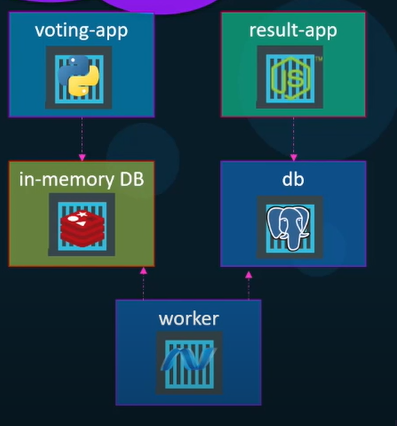

## Docker Command Summary

### exec

Allows the execution of any given command within a Docker container. The arguments passed after `exec` command will be the commands run in the container.

Example:

`docker exec -it <container_id_or_name> /bin/bash` starts running bash terminal of the container in **interactive and terminal mode** so that you can type input and receive output

### run - create a constainer from image and start it

- Runs a command from an image.
- If image does not exists, pulls from DockerHub onece
- By default in **attach mode** (blocks terminal, need CTRL+C to exit)
- `-d` to run in **detach mode** (go back to terminal immediately)
- `docker attach <id>` to attach a detached container
- `-i` for **interactive mode** (can type in STDIN)
- `-t` for **terminal mode** (can receive STDOUT)
- `redis:4.0` in `docker run redis:4.0` is a tag to specify running version 4.0 of redis. By default, tag is `latest`
- **Port mapping** allows to run many instances of e.g. MySQL on the same host: `docker run -p <hostport>:<containerport> ...`
- **Volume mapping** to persist data after container stopped or removed: `docker run -v <local_directory_path> ...`
- `-e` to add a list of **environment variables** when running the container
- `--name` to name the tag of container
- can add commands after `<container_name>` to overwrite default commands. E.g. `docker run ubuntu sleep 5`s
- `--network=<network_name>` runs the container and attaches it to a network

  Example:

1. `docker run nginx`
1. `docker run ubuntu sleep 5`
1. `docker run -d --name discourse_app local_discourse/app`
1. `docker run -p <hostport>:<containerport> local_directory/app`
1. `docker run -e APP_COLOR=blue myappname`
1. `docker run --name alpine-2 --network=none alpine`

### ps - list containers

- `-a` to include previously stopped or exited containers
- `-q` for quiet mode and display on container IDs
  Example:
  `docker ps`

### stop - stop a container

- once stopped, won't appear on `docker ps`
  Example:
  `docker stop <name>`

### start - restart a stopped container

Example:
`docker start <name>`

### rm - remove a container permanently

- once stopped, won't appear on `docker ps -a`
  Example:

1.  `docker rm <name>`
1.  `docker rm -f $(docker ps -a -q)` to remove all containers

### rmi - remove images

- must remove and stop all dependent containers with this image

1. `docker rmi $(docker images -a -q)` to remove all images

### images - list images

### image

- `prune` remove unused images
- `tag` creates a tag TARGET_IMAGE that refers to SOURCE_IMAGE
- `ls` list images
- `rm` remove one or more images
- `inspect` displayed details of an image

### pull

- only pulls the image, but not run it

### inspect - inspect container

Example:
`docker inspect <container_name>`

### log - container logs

- Used to view contents of STDOUT of containers run in detached mode

Example:
`docker log <container_name>`

### log - container logs

- Used to build an image from a Dockerfile
- `-t` to add tag name for the build

Example:
`docker build -t <image_name> .`

### network

- `connect` or `disconnect` to connect/disconnect a container to a network
- `create` to create a new network.
- `ls`
- `rm`
- `inspect`

### volume

Example:

1. `docker volume create <volume_name>` creates a volume in `/var/lib/docker/volumes/volume_name` directory
2. `docker run -v <volume_name>:<container_path> ...` to attach container volume to local volume

### log

Example:

1. `docker log <container_name>`

### login and private registries:

Example:

1. `docker login <private_registry_url_or_ip>`
1. `docker run -d -p 5000:5000 --restart-always --name my-registry registry:2` to run your own registry named `my-registry` using the `registry` image from DockerHub. Note that the registry server is exposed on port 5000 in the image
1. `docker image tag <image-to-be-tagged> <tag_registry_url>` to tag the registry url to an image
1. `docker push <url>` (e.g. `docker push localhost:5000/my-image`) to push to registry so that others can pull from the registry
1. `docker pull <registry_url/image_name>` to pull

## Dockerfile

- Instruction + Argument format
- Layered architecture
  - Docker builds each command as a layer and adds on previous layers
  - Layers are cached, in case one fails, can start running again from that one

### FROM: from base OS

Initializes a new build stage and sets the Base Image for subsequent instructions

Example:

1. `FROM Ubuntu`

### RUN: run commands

- Usually used to install dependencies after `FROM` command

Example:

1. `RUN pip install flask`

### ENV: set environmental variables

Note that it may be better to declare this in docker compose file instead.

Example:

1. `ENV MONGO_DB_USERNAME=admin MONGO_DB_PWD=password`

### COPY: copy file from local to container

Example:

1. `COPY . /opt/source-file`

### ENTRYPOINT

- Syntax

  - `ENTRYPOINT ["command"]`

- Example:
  1. `ENTRYPOINT ["sleep"]` in the Dockerfile will have same result as `docker run containername sleep` when you just run `docker run containername`

### CMD : default commands when run

Appends default command or parameters to ENTRYPOINT

- Syntax

  - `CMD command param 1`
  - `CMD ["command", "param1"]`

- Example:
  1. `CMD sleep 5`

## Docker Networks

- 3 networks `bridge`, `none`, and `host` created automatically when Docker installed
- `Bridge` network is a private internal network created by Docker on host. All containers attached to this network by default and have internal IP of 172.17.X.X.
  To access containers from outside, do port mapping from container to docker host as mentioned above
- `Host` assocoiates container network to host network directly. (e.g. port 5000 on container is port 5000 on host). No port mapping required. But this means that we cannot run two containers that need container port 5000.
- `None` network: containers are not attached to any network and does not have access to external networks. They run in an isolated network.

### Inspecting Network

`docker inspect <container_name>` and find section on **NetworkSettings**

### User-defined networks

```
docker network create \
    --driver bridge \
    --subnet 182.18.0.0/16
    --gateway 182.18.0.1
    custom-isolated-network
```

### Embedded DNS: connecting containers within same docker host

## Docket Storage

- When Docker is installed, a folder `/var/lib/docker` is created and has subfolder `aufs`, `containers`, `image`, `volume` to store respective data

### Docker Layered Architecture

- Each instruction in Dockerfile corresponds to one layer
- For two different Dockerfiles, if some instructions are same, docker caches the layer and resuses them
- `build` command build the `image layers` which are **read only** and does not change after the build.
- `run` command creates a new writable `container layer` on top of the `image layers`. The life of this layer is only as long as the container's lifespan
- Since many containers can share an image, if the application code in the image is changed after build, docker performs **copy-on-write** to create a copy of the code in the container layer. The image layer will only be updated on the next build.

### Volume mounting

The following code creates a volume named `data_volume` and mount the containers `mysql` folder onto local `data_volume` folder whlie running mysql container:

1. `docker volume create data_volume`
1. `docker run -v data_volume:/var/lib/mysql mysql`

### Bind mounting

Similar to volume mounting, but instead of creating a new volume in `var/lib/docker/volumes` folder, mounts the container directory on an existing local directory

1. `docker run -v /data/mysql:/var/lib/mysql mysql` (old style)
1. `docker run --mount type=bind,source=/data/mysql,target=/var/lib/mysql mysql` (new style). type can be `bind`, `volume`, `tmpfs`

### Storage Drivers

Docker storage drivers are responsible for maintaining layered architecture, creating writable layer and moving files from container to local etc. Common storage drivers as AUFS, ZFS, BTRFS, Device Mapper, Overlay, Overlay2 etc. depending on OS.

## Docker Compose

Image if we want to link a few applications as follows:



### Option 1: Using link (deprecated)

1. `docker run -d --name=redis redis` (create redis container)
1. `docker run -d --name=db postgres:9.4 --link db:db result-app` (create mysql container)
1. `docker run -d --name=vote -p 5000:80 --link redis:redis voting-app` (create python flask app)
1. `docker run -d --name=result -p 5001:80` (create NodeJS app)
1. `docker run -d --name=worker --link db:db --link redis:redis worker` (create .NET app)

Syntax:

`docker run --link <container_name_A>:<reference_nameofA_written_in_code_B> <container_name_B>`

### Option 2: Using Docker compose (version 1)

The following is same as above

1. Create a **.yml** file named `docker-compose.yml`
2. `docker-compose -f <yml_filename> up` (up means run all containers in the file, down will stop all containers and remove all networks, volumes, images and container created by up)

```
redis: # this is same as --name
    image: redis # the image used to create the container
db:
    image: postgres:9.4
vote:
    image: voting-app
    ports:  # same as -p
        - 5000:80
    links:
        - redis
result:
    image: result-app
    ports:
        - 5001:80
    links:  # same as --link
        -db
worker:
    image: worker
    links:
        - redis
        - db:db = db
```

`image: voting-app` can be replaced with `build: ./vote` to build the image from `vote` directory if the image may not have been built

### Option 3: Using Docker compose (version 2)

```
version: "2" # need to specify
services: # everything in v1 moved under services
    redis:
        image: redis
        networks:
            - back-end
    db:
        image: postgres:9.4
        environtment:
            POSTGRES_USER: postgres
            POSTGRES_PASSWORD: postgres
        networks:
            - back-end
    vote:
        image: voting-app
        networks:
            - front-end
            - back-end
        ports:
            - 5000:80
        depends_on: # tells docker that vote should only start up after redis
            - redis
    result:
        image: result-app
        networks:
            - front-end
            - back-end
        ports:
            - 5001:80
    worker:
        image: worker
networks:
    front-end:
    back-end:
```

- In v1, all containers are attached to docker's default bridge network, and use links to communicate. In v2, docker creates a **dedicated bridge network** for this application so that containers can communicate using names and get rid of links.
- We can also create different networks (e.g. `front-end` and `back-end` above) for different applications
- `depends_on` from v2 allows us to specify start up **order** of applications
- v3 onwards support Docker Swarm

## Docker Enginer: How it works under the hood

When we install Docker, we are installing Docker Engine that consists of REST API, Docker Daemon, Docker CLI

- Docker Daemon is a background process that manages Docker objects such as containers, volumes, images, networks etc.
- REST API provides interface for programs to talk to Docker Daemon
- Docker CLI is just the CLI, and uses REST API interface to send instructions to the Daemon
- It's possible to use our laptop's CLI to send instructions to another docker host using `docker -H=<remote_ip:port> run ...`

### How does containerization avoid conflict?

Docker uses namespaces to isolate workspaces on host, such that each container can have their own sets of the following without conflict with host:

- Process ID
- Network
- Interprocess
- Unix timesharing
- Mount

### How does docker manage resources since it shares with the host?

Docker uses `cgroups` or **control groups** to restrict resouces used by the container on the host since technically a container can use up all host resources.

Example:

1. `docker run --cpus=.5 ubuntu` means at most 50% of host cpu usage allocated to this container
1. `docker run --memory=100m ubuntu` limits amount of memory to 100MB for the container

## Other non-docker related stuff

- /etc/\*release\* contains information about the os distribution

## References

- Techworld with Nana Youtube - https://www.youtube.com/watch?v=3c-iBn73dDE&list=PLhU5ASrwuTJfbjxP2PpUhwFIzAzTRhzqD&index=5&t=2512s
- KodeKloud Free Course - https://kodekloud.com/courses/docker-for-the-absolute-beginner/
