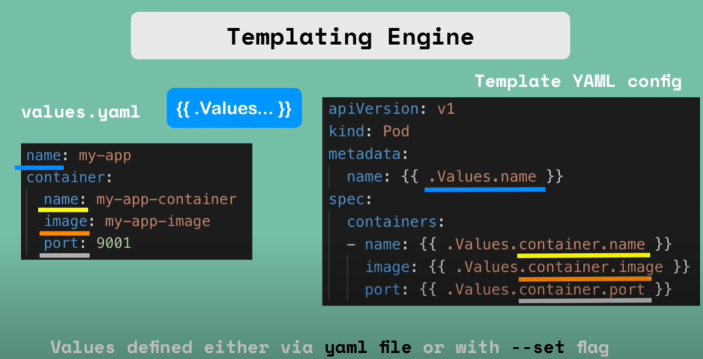
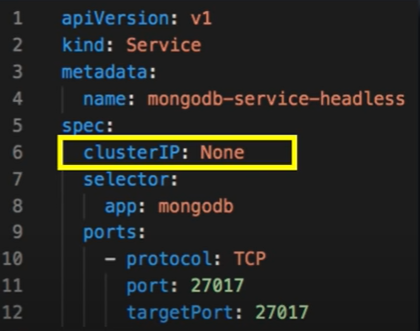
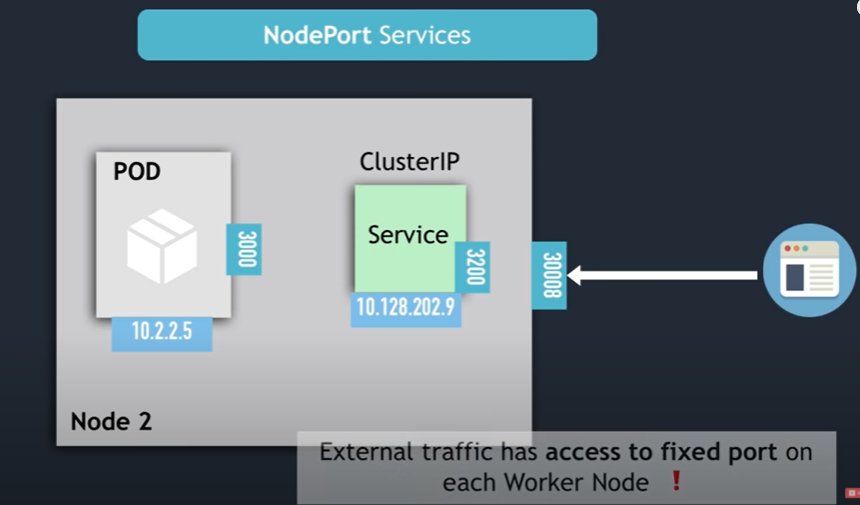

# Kubernetes

## What is Kubernetes and what it solves

### What it is

- container orchestration tool
- manage containerized applications in different deploment environments

### What it solves

- rise of microservice architecture give rise to use of containers
- kubernetes helps ensre **high availability** of containers and no downtime
- kubernetes is used for **scalability** where applications can be scaled depending on requirements and performances
- kubernetes helps with **disaster recovery** to backup and restore state of applications

## K8 Main components

### Pods

- Pod is **abstraction over container**, so that we can use any container technology (not only Docker)
- Pod is usually meant to run one container, or very tightly coupled containers
- Each Pod has its own internal IP address that can be used for inter-pod communication
- Pods are **ephemeral**, which means they die easily, and new pods with _new IP address_ gets created

### Services and Ingress

- **Service** is a **permanent IP address** attached to each Pod. So that when one Pod of same type dies and gets replaced, the IP address is still the same.
- **Service** is also a **load balancer** which forwards requests to least busy ports
- Lifecycle of Pod and services not connected
- Services can be **external** or **internal**, specified during creation (e.g. _NodePort_ or _ClusterIP_)
- Application request goes to **Ingress** first before it gets forwarded to **Service** because url of external Service is not very practical (uses IP address of node, and may not be secure)

### ConfigMap and Secret

- **ConfigMap** sets up the configuration between Services (e.g. my-app-service needs to connect to mongo-db-service)
- Traditionally done by setting up mongo-db url in my-app code and built
- But traditional method requires rebuilt and redeployment if a single url changes
- With **ConfigMap** only need to change ConfigMap in this case
- **Secret** is like ConfigMap but stores secret information such as database username and password

### Volume

- Without **Volume**, data is not persisted if Pod is restarted
- A **Volume** is a physical storage on hard drive (can be local storage or on cloud) that is attached to a Pod to store persistent data

## Deployment and StatefulSet

- **Deployment** is a **blueprint** for _my-app_ pods. We can specify how many **replicas** we want of the pod and have features such as auto-scaling
- An abstraction of pods, just like how pods are abstractions of containers
- Deployment manages a **replicaset**, and a replicaset manages all replicas of a pod
- In practice, we mostly work with deployments instead of pods
- Deployment only handles **Stateless Apps**
- **StatefulSet** is like Deployment but handles **Stateful Apps** such as databases

## K8 Architecture

Kubernetes operates on **Clusters**. Each cluster has **Nodes** which are individual machines or VMs.
There are two types of Nodes in a cluster: _Master_ nodes and _Slave/Worker_ nodes.

### Node

- Each Node has multiple Pods on it
- 3 processes must be installed in every node:
  - **Container** runtime (such as Docker)
  - **Kubelet** interacts with both container and node, and starts the pod with a container inside
  - **Kube proxy** forwards requests between nodes (for example if different nodes have a same service, the proxy can forward requests from a node with higher load)

## Master Nodes

A production cluster typically have more than one master nodes.

- What it does:
  - schedule pods
  - monitor podss
  - reschedule/restart pods
  - join a new node
- 4 main processes needed:
  - **API Server** - Gateway/Entrypoint of the cluster. Request can be sent to API Server using UI/CLI/API
  - **Scheduler** looks and resources needed for request, and _decides_ which Node the Pod should be scheduled. (_kubelet does the actual creation of pods_)
  - **Controller mananger** detects cluster state changes (e.g. pod dies) and informs Scheduler
  - **etcd** is the _cluster brain_. It is a _key-value_ store that store changes in the cluster, **not application data**
  - These changes includes state changes such as _what resources are available?_ _which pod died?_ etc and both **Control manager** and **Scheduler** obtain info from **etcd**

## Minikube and kubectl

### Minikube

- In production, there are multiple master and worker nodes in a cluster - hard to set up in local environment
- **Minikube** is a one-node cluster where master and worker processes all runs on the same machine. Docker is also preinstalled.
- It can be run in a VM or as a container

### kubectl

- The CLI tool that is used to communicate with the API Server process in Master Nodes

## Main kubectl Commands

### get

Gets information of any type of components

- `-o wide` after `get ...` to display more information

`kubectl get <component_type>`

Example:

1. `kubectl get nodes`
1. `kubectl get services`
1. `kubectl get pod`
1. `kubectl get replicaset`

### create

Create any type of component. Note: cannot create pod because deployments are created instead

- `-f` flag to create from file

`kubectl create <component_type>`

Example:

1. `kubectl create deployment ngninx-depl --image=nginx`

### edit

Edits a component. The terminal will open up an auto-generated configuration file to be edited.

Example:

1. `kubectl edit deployment <deployment_name>`

### logs

Used for debugging pods. What is usually printed on stdout of the container will be now be printed out as logs.

Example:

1. `kubectl logs <pod name>`

### exec

Used for debugging pods like _logs_.

Example:

1. `kubectl exec -it <pod name> -- bin/bash` opens the bash terminal of the pod

### describe

Used to describe a pod

Example:

1. `kubctl describe pod <pod name>`

### delete

- `-f` flag to delete using configuration file

Example:

1. `kubectl delete deployment <name>`

### apply

Takes the configuration file as parameter and setups based on the configuration file

Example:

1. `kubectl apply -f <filename>`

## K8's YAML Configuration file

- 3 parts of Configuration files:
  - metadata (e.g. name of component and label)
  - specification (diff details for diff type of components)
  - status (automatically generated)
- Kubernetes uses **status** specified to check if the desired status matches the actual status, and tries to perform **self-healing** otherwise (e.g. if specified 2 replicas, but only have 1 replica and some point in time)

Sample YAML Configuration files are shown below. They are usually stored with application code

###

```
apiVersion: apps/v1
kind: Deployment # what type of component
metadata:
    name: nginx-deployment
    labels:
        app: nginx
spec:
    replicas: 2
    selector:
        matchLabels: # match all pods with label key app and label value nginx
            app: nginx
    template:   # template for each pod
        metadata: # metadata for pod
            label: # specifies label so that deployment will select this pod
                app: nginx
        spec:
            containers:
            - name: nginx
              image: nginx:1.16
              ports:
              - containerPort: 8080
              env:
              - name: MONGO_INITDB_ROOT_USERNAME
                valueFrom: # can use value: directly, but in this case we are getting from secret file
                    secretKeyRef:
                        name: mongodb-secret # as specified in secret file
                        key: mongo-root-username # also from secret file
              - name: MONGO_INITDB_ROOT_PASSWORD
                value: somepassword # everyone can see!
```

## K8's namespaces

`kubectl create namespace <name>` or using configuration file

- Used to organise resources in clusters
- Volume and Nodes cannot be created within namespace, they live globally, ConfigMap, Secret, Services, Deployments etc. can
- Something like "virtual cluster inside a cluster"
- When a cluster is being created, some namespaces are already created by default:
  - **kube-system** contains System processes, as well as Master and Kubectl processes
  - **kube-public** contains publicly available data (e.g. ConfigMap data)
  - **kube-node-lease** holds the heartbeats of nodes. Each node has associated lease object in namespace that _determines the availability of the node_
  - **default** namespace contains resources that we create

### Why namespace?

1.  So that resources are grouped according to functionality. For example:

    - _Database_ namespace
    - _Monitoring_ namespace
    - _Elastic Stack_ namespace
    - _Nginx-Ingress_ namespace

2.  Avoid name conflicts if many team using the same cluster and application. Using namespace allows limiting accesss to resources for different teams.

3.  Resource Sharing: Staging and Development

4.  Resource Sharing: Blue/Green Deployment

5.  Access and Resouce

### Creating components in namespace

Use `-n` or `--namespace=` flag:

`kubectl apply -f my-configmap.yaml -n <namespace>`

or

Use `namespace: <namespace>` under metadata in config file

By default, components are created in the `default` namespace

### Getting components in namespace

Use the same flags as above.

To reference some resource in a namespace from another config file, use `mongo-db.<namespace>` (previously only `mongo-db`)

## K8 Ingress Component

Ingress is like a routeer that routes the requesr to internal network

### Ingress controller

- Ingress component defines all the rules for routing, and is insufficient alone.
- An implement for Ingress called **Ingress Controller** is needed. (usually a pod, or a set of pods)
- Roles of Ingress Controller:
  - evaluates all the rules specified by Ingress
  - manages redirecions
  - **serves as entrypoint** to cluster
- `minikube addons enable ingress` to install default K8s Nginx implementation of Ingress Controller

### Example Ingress Config file

```
apiVersion: networking.k8s.io/v1
kind: Ingress
metadata:
  name: dashboard-ingress
  namespace: kubernetes-dashboard
spec:
  tls: # used to configure https
  - hosts:
    - bing.com
    secretName: bing-secret-tls # reference to tls cert stored in secret component
  rules:
  - host: dashboard.bing.com # can also have multiple hosts if have subdomains
    http:
      paths:
      - path: /test # example of multiple paths
        backend:
          serviceName: kubernetes-dashboard
          servicePort: 80 # port must match service port
        - path: /api
          backend:
            serviceName: shopping-api
            servicePort: 3000
  - host: analytics.bing.com
    ...
    ...
```

## Helm

Helm is a **package manager** and **templating enginer** for managing yaml files for kubernetes (just like npm)

### Helm Charts and package manager

Imagine if we want to add ELASTIC Stack into our cluster, we probably need to write or find all service, configmap, secret, statefulset yaml files online.

**Helm Chart** is the bundle of yaml files that others have already wrote

### Helm as Templating Enginer



### Helm Chart Directory Structure

```
mychart/ # name of the Helm chart
  Chart.yaml # stores meta-info about chart
  values.yaml # stores values for template
  charts/ # stores chart dependencies (e.g. if this chart depends on other charts)
  templates/ # stores template config files
```

- `helm install <charname>` will install the helm chart with default values in `values.yaml`
- `helm install --values=my-values.yaml <chartname>` allows further overriding of some values specified in `values.yml`
- `helm install --set <valuename>:<value of value> <chartname>` works too, but troublesome if need to set many values

## Volumes: Persistent Storage in K8s

K8s does not manage storages! Need to **create and manage** ourselves. Think of storages just as _plugins to the whole cluster_

**Desired properties of storage**:

1. Storage does not depend on pod lifecycle
1. Storage must be available on all nodes (because we never know which node will crash)
1. Storage must survive even if cluster crashes

Remote storage more preferred over local storage (other than ConfigMap and Secret) because local storage violates properties 2 and 3 above

**3 types of volume storage in K8s**:

1. Persistent Volume (PV)
1. Persistent Volume Claim (PVC)
1. StorageClass (SC)

Overview:

1. **K8s Administrator** creates remote storage (e.g. google cloud), and then creates PV in cluster connected to those remote storage
1. **K8s Users** specify what volume they need in a PV Claim. Kubernetes will automatically match any PV that matches the requirements and allocate to the user.

### Persistent Volume

- A **cluster resouce** created via YAML file
- Not namespaced, accessible to whole cluster
- Needs to be there before cluster even exists. Created by **K8s Administrator**

### Persistent Volume Claim

- **K8s Users** (e.g. developers) need to claim the PV created for their application, so they create a PV Claim component
- Also created with YAML config file
- PVC must live in the same namespace as the pod using the claim
- Pod finds suitable PV through PV Claim, then **mounts volume onto pod**, and in turns **mounts volume onto container** in the pod
- We can decide to mount volume for all containers in the pod, or only specific ones

### ConfigMap and Secret

- **local volumes** mounted on a pod
- not created via PV and PVC
- managed by Kubernetes

### Storage Class

- Consider large applications with hundreds of apps that are deployed frequently
- Users need request for administrator amount of storage required, and admin needs to request from cloud provider
- **Storage Class** creates PVs _dynamically_, and makes the
  process more efficient
- Uses a YAML config file, and `provisioner` attribute to know which storage provider to ask for storage when not enough
- Inside PVC config file, use `storageClassName` to specify the storage class to request from
- Flow: PVC request -> Storage Class ask from provider -> Storage Class creates PV and gives it to PVC

## StatefulSet

Unlike **Deployment** pods for StatefulSet:

- cannot be created/deleted at the same time
- cannot be **randomly addressed**, they are ordered starting from 0
- each pod has individual service/DNS name (they are shared in **Deployment**)
- replica Pods are not identical:
  - each pods has **persistent identifier** (order and dns) that is not changed across any re-scheduling
  - pods are not interchangeable
- have master and slave pods when duplicating stateful apps (e.g. database):
  - Only the one master pod can update database
  - Slaves can only read
  - Synchronization needed since all master and slave pods have different storage
  - Upon next query request, slave pulls from master to update their own storage
  - When next slave pod created (e.g. mysql-3), it must copy from previous pod (e.g. mysql-2, not mysql-1)

Each pod stores its own **pod state** (contains info such as whether its master or slave, and identifier etc) in its own storage.

When the pod dies, presistent pod identifiers makes sure that storage volume gets reattached to the replacement because the storage has the state of the pod

## Services

How routing works:

1. Depending on number of replicas, each node have a range of IP addresses. Each pod in the node gets an IP from the node's range
2. Services also runs on a node and has its own IP.
3. A pod may have few containers at different ports. How does service know which pods to match and which ports?
4. Ingress -> Service (on its IP and port defined in `servicePort` of Ingress config file) -> Pod (`selector` to identify pods and `targetPort` to identify port)
5. **All** selectors specified in service must be matched

4 types of Services:

- ClusterIP
- Headless
- NodePort
- LoadBalancer

### CluserIP

- default type of service. Refer to _How routing works_

### Headless Services



- What if external client wants to communicate with 1 specific Pod directly
- What if pods want to talk directly with specific Pod
- Pods cannot be randomly selected like ClusterIP
- Use Case: In Stateful applications, communication to master pod or most recent pod required
- if clusterIP not `None`, then when doing DNS lookup, a single IP of service will be returned. But if set to `None`, many IP of pods will be returned instead.
- Client does own DNS lookup to get pod IP and then connects to desired pod

### NodePort



- Exposes a static/fixed port on each node that the service is in
- defined using `nodePort` attribute (must range from 30000 - 32767)
- ClusterIP also created automatically when NodePort created, as seen in image above
- Not so secure because people can access to nodes directly. Probably only used for testing and rarely used for external connection in production

### LoadBalancer

- Like **NodePort**, but only LoadBalancer can access to the nodePort
- NodePort and ClusterIP created automatically when LoadBalancer is created

### Summary

- LoadBalancer Service is extension of NodePort Service
- NodePort Service is extension of ClusterIP service
- Headless Service is just ClusterIP without IP

## References

- Techworld with Nana Youtube - https://www.youtube.com/watch?v=X48VuDVv0do
